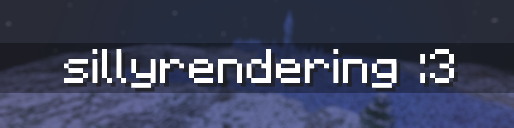

## ℹ️ about sillyrendering
makes your game renderer silly! every vertex position is randomized when possible
- models (item, blocks) are randomized only on start, because of game limitations.
- world chunks are randomized only when they are updated (place block, break block, etc.)
- gui is extremely silly!

## 📔 plans
i want to backport this mod to 1.20.x (currently only for 1.20.4) and 1.19.x in the future

## 🎮 compatibility
im not sure about compatibility with other mods, because this mod mixins some funny rendering classes.
if you found any issue, feel free to report it in `Issues` tab!

## 📸 screenshots

